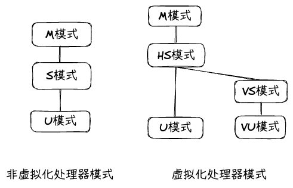

# RISC-V虚拟化扩展学习总结

## CPU虚拟化扩展

### 特权级架构变化

RISC-V H 扩展引入了虚拟化支持：

```
M-mode (机器模式) → 固件
    ↓
HS-mode (Hypervisor) → 虚拟机监视器
    ↓
VS-mode (虚拟Supervisor) → Guest操作系统
    ↓
VU-mode (虚拟User) → Guest应用程序
```



### V 标志位

V 是 `hstatus` 寄存器中的关键位：
- `V=1`: 处理器在虚拟化模式 (VS/VU 模式)
- `V=0`: 处理器在非虚拟化模式 (M/HS/U 模式)

### CSR 寄存器类型

| 类型 | 说明 |
|------|------|
| `m<csr>` | M 模式寄存器 |
| `s<csr>` | S 模式寄存器 (HS 模式访问时) |
| `h<csr>` | HS 模式专用寄存器 |
| `vs<csr>` | VS 模式寄存器 (V=1 时有效) |

| 当前模式 | 访问的寄存器 | 实际访问的寄存器 | 说明 |
|----------|--------------|------------------|------|
| **HS模式** | `s<csr>` | 原S模式系统寄存器 | 直接访问Supervisor模式的寄存器 |
| **HS模式** | `h<csr>` | HS模式专用寄存器 | 访问Hypervisor扩展的寄存器 |
| **HS模式** | `vs<csr>` | VS模式系统寄存器 | 访问虚拟Supervisor模式的寄存器 |
| **VS模式** | `s<csr>` | `vs<csr>`寄存器 | 自动重定向到虚拟Supervisor寄存器 |

### 关键 CSR 寄存器

#### HS 模式专用 (h<csr>)

| 寄存器 | 功能 |
|--------|------|
| `hstatus` | Hypervisor 状态控制 (SPV, SPVP 等) |
| `hedeleg` | 异常委托给 Guest |
| `hideleg` | 中断委托给 Guest |
| `hgatp` | G-Stage 页表基址 (GPA → HPA) |
| `hvip` | 虚拟中断挂起 |
| `htval` | 缺页异常的高位地址 |
| `htinst` | 陷阱指令信息 |

#### VS 模式专用 (vs<csr>)

| 寄存器 | 功能 |
|--------|------|
| `vsstatus` | VS 模式状态 |
| `vstvec` | VS 模式异常入口 |
| `vsepc` | VS 模式异常返回地址 |
| `vscause` | VS 模式异常原因 |
| `vstval` | VS 模式异常相关信息 |
| `vsatp` | VS-Stage 页表基址 (GVA → GPA) |

#### M 模式扩展 (m<csr>)

RISC-V H 扩展为 M 模式引入了新的虚拟化支持，主要涉及以下几个方面：

**mstatus 寄存器扩展**

mstatus 寄存器在虚拟化扩展中新增了两个关键字段：

| 字段 | 位 | 功能 |
|------|-----|------|
| **MPV** (M-mode Previous Virtualization) | [37] | 指示从 M 模式返回时的虚拟化状态 |
| **GVA** (Guest Virtual Address) | [38] | 指示异常是否来自 Guest 虚拟地址 |

```
MPV (Previous Virtualization):
  - MPV=1: mret 返回时进入 HS/VS 模式 (而非普通 S 模式)
  - MPV=0: mret 返回时进入正常执行模式

GVA (Guest Virtual Address):
  - GVA=1: 异常来自 Guest 虚拟地址 (GVA)
  - GVA=0: 异常来自物理地址或 HS 模式地址
```

**MPV 与 MPRV 的配合**

当 `mstatus.MPRV = 1` 时（用于加载数据时使用不同权限级）：

| MPRV | MPV | 地址转换使用的页表 |
|------|-----|---------------------|
| 0 | X | 当前模式对应的页表 |
| 1 | 0 | 使用 satp (S 模式页表) |
| 1 | 1 | 使用 vsatp (VS 模式页表) |

这允许 M 模式固件在处理虚拟化相关异常时，能够正确访问 Guest 的虚拟地址空间。

**mip 和 mie 寄存器扩展**

中断挂起 (mip) 和中断使能 (mie) 寄存器新增了虚拟化中断位：

| 字段 | 全称 | 说明 |
|------|------|------|
| **VSSIP** | Virtual Supervisor Software Interrupt Pending | VS 模式软中断挂起 |
| **VSTIP** | Virtual Supervisor Timer Interrupt Pending | VS 模式定时器中断挂起 |
| **VSEIP** | Virtual Supervisor External Interrupt Pending | VS 模式外部中断挂起 |
| **SGEIP** | Supervisor Guest External Interrupt Pending | S 模式 Guest 外部中断挂起 |

```
中断位映射关系:
┌─────────────────────────────────────────────────────────────────┐
│  中断类型        │  HS 模式寄存器    │  VS 模式寄存器            │
├─────────────────────────────────────────────────────────────────┤
│  软中断          │  mip.SSIP        │  vsip.VSSIP (委托时)      │
│  定时器中断      │  mip.STIP        │  vsip.VSTIP (委托时)      │
│  外部中断        │  mip.SEIP        │  vsip.VSEIP (委托时)      │
└─────────────────────────────────────────────────────────────────┘
```

**mtval2 寄存器**

```
mtval2 (Machine Trap Value 2):
  - 功能: 记录 Guest 物理地址 (GPA)
  - 触发条件: 当异常来自 Guest 且需要记录 GPA 时
  - 典型场景:
    • G-Stage 页表缺页异常
    • Guest 物理内存访问错误
```

| 异常类型 | mtval | mtval2 |
|----------|-------|--------|
| VS-Stage 缺页 | GVA | (未使用) |
| G-Stage 缺页 | GPA | GPA 高位 |
| Guest 访问错误 | 访问地址 | GPA 相关信息 |

**mtinst 寄存器**

```
mtinst (Machine Trap Instruction):
  - 功能: 记录触发异常的指令信息
  - 格式: 包含指令编码或部分指令信息
  - 用途: 帮助固件/Hypervisor 诊断和模拟指令

典型场景:
  1. Guest 执行非法指令 → mtinst 记录指令编码
  2. Guest 访问未映射内存 → mtinst 记录访存指令
  3. 特权违反 → mtinst 记录违规指令
```

**mideleg 和 medeleg 寄存器**

虽然不是 H 扩展新增，但这两个寄存器对虚拟化至关重要：

| 寄存器 | 功能 | 虚拟化中的作用 |
|--------|------|----------------|
| **mideleg** | 中断委托 | M → HS 委托，HS → VS 进一步委托 |
| **medeleg** | 异常委托 | M → HS 委托，HS → VS 进一步委托 |

```
委托链路:
M 模式 (固件)
    │ mideleg/medeleg
    ▼
HS 模式 (Hypervisor)
    │ hideleg/hedeleg
    ▼
VS 模式 (Guest OS)
```

**M 模式与虚拟化的交互**

```
┌─────────────────────────────────────────────────────────────────┐
│                       M 模式固件                                │
│  ┌───────────────────────────────────────────────────────────┐  │
│  │  初始化阶段:                                              │  │
│  │    1. 设置 mideleg/medeleg (委托中断/异常给 HS 模式)     │  │
│  │    2. 配置 H 扩展启用位                                   │  │
│  │    3. 设置初始 hgatp (G-Stage 页表)                       │  │
│  └───────────────────────────────────────────────────────────┘  │
│                           │                                     │
│                           ▼                                     │
│  ┌───────────────────────────────────────────────────────────┐  │
│  │  运行时异常处理 (如果未委托给 HS):                        │  │
│  │    - 访问 mtval2 获取 GPA                                 │  │
│  │    - 访问 mtinst 获取指令信息                             │  │
│  │    - 检查 mstatus.MPV 判断虚拟化状态                      │  │
│  │    - 根据 mstatus.GVA 判断地址类型                        │  │
│  └───────────────────────────────────────────────────────────┘  │
└─────────────────────────────────────────────────────────────────┘
                            │
                            ▼
┌─────────────────────────────────────────────────────────────────┐
│                     HS 模式 (Hypervisor)                        │
│  • 处理大部分 VMExit                                            │
│  • 使用 hideleg/hedeleg 进一步委托给 Guest                      │
│  • 管理 Guest 物理内存和设备模拟                                │
└─────────────────────────────────────────────────────────────────┘
```

### 两级地址转换 (Stage-2 EPT)

RISC-V H 扩展引入了两级地址转换机制：

```
GVA (Guest Virtual Address)
    │ vsatp (VS-Stage)
    ▼
GPA (Guest Physical Address)
    │ hgatp (G-Stage)
    ▼
HPA (Host Physical Address)
```

**VS-Stage (第一级)**: 由 Guest OS 配置，使用 `vsatp` 寄存器指向 Guest 的页表，将 GVA 转换为 GPA。

**G-Stage (第二级)**: 由 Hypervisor 配置，使用 `hgatp` 寄存器指向 Host 的页表，将 GPA 转换为 HPA。

这种两级转换允许 Guest OS 管理自己的虚拟地址空间，而 Hypervisor 控制 Guest 物理内存到 Host 物理内存的映射，实现了内存隔离和灵活的内存管理。

---

## 进入和退出虚拟机

### 进入虚拟机 (VMEntry)

VMEntry 是 Hypervisor 主动切换到 Guest 的过程，关键步骤如下：

```rust
// 1. 设置 hstatus.SPV = 1 (返回时进入 VS 模式)
hstatus.modify(hstatus::spv::Supervisor);

// 2. 设置 hstatus.SPVP = Supervisor (Guest 在 VS 模式)
hstatus.modify(hstatus::spvp::Supervisor);

// 3. 设置 sstatus.SPP = Supervisor
sstatus.set_spp(sstatus::SPP::Supervisor);

// 4. 设置 sepc 为 Guest 入口地址
sepc::write(guest_entry);

// 5. 执行 sret
sret;  // → 进入 VS 模式
```

### 退出虚拟机 (VMExit)

VMExit 是由于特定事件导致硬件自动从 Guest 切换回 Hypervisor 的过程。

**触发条件**:
- **异常**: 缺页 (G-Stage 或 VS-Stage)、非法指令、特权违反等
- **中断**: 定时器中断、外部中断、软中断
- **指令**: `ecall` (SBI 调用)、`sfence.vma` 等

当 VMExit 发生时，硬件自动完成以下操作：
1. 保存当前的 PC 到 `sepc`
2. 记录异常/中断原因到 `scause`
3. 根据异常类型设置 `stval`、`htval`、`htinst` 等寄存器
4. 切换特权级到 HS-mode
5. 跳转到 `stvec` 指向的处理代码

Hypervisor 在处理完 VMExit 后，通过设置相关寄存器并执行 `sret` 返回 Guest。

---

## riscv_vcpu 模块详解

**文件**: [arceos/modules/riscv_vcpu](../arceos/modules/riscv_vcpu)

`riscv_vcpu` 是 ArceOS 中独立的 RISC-V vCPU 实现模块，封装了所有与硬件虚拟化相关的底层操作，为上层 Hypervisor 提供简洁的抽象接口。

### 模块架构

```
┌─────────────────────────────────────────────────────────────────┐
│                    Hypervisor (h_2_0/h_3_0/h_4_0)              │
│  ┌───────────────────────────────────────────────────────────┐  │
│  │  main.rs:                                                 │  │
│  │    RISCVVCpu::init()                                      │  │
│  │    vcpu.run() -> AxVCpuExitReason                          │  │
│  └───────────────────────────────────────────────────────────┘  │
└─────────────────────────────────────────────────────────────────┘
                            │ 依赖
                            ▼
┌─────────────────────────────────────────────────────────────────┐
│                      riscv_vcpu 模块                            │
│  ┌─────────────┐  ┌─────────────┐  ┌─────────────────────────┐│
│  │  vcpu.rs    │  │  csrs.rs    │  │  sbi/                   ││
│  │             │  │             │  │  - base.rs              ││
│  │ RISCVVCpu   │  │ CSR 抽象    │  │  - rfnc.rs              ││
│  │ VmCpuRegisters│ │            │  │  - pmu.rs               ││
│  │ VMExit 处理 │  │             │  │  - ...                  ││
│  └─────────────┘  └─────────────┘  └─────────────────────────┘│
│  ┌─────────────┐  ┌─────────────────────────────────────────┐ │
│  │  guest.S    │  │  regs.rs                                 │ │
│  │             │  │  GeneralPurposeRegisters                  │ │
│  │ 世界切换     │  │  GprIndex                                │ │
│  │ 汇编代码    │  │                                          │ │
│  └─────────────┘  └─────────────────────────────────────────┘ │
└─────────────────────────────────────────────────────────────────┘
```

### 核心数据结构

#### VmCpuRegisters - vCPU 完整状态

`VmCpuRegisters` 是 vCPU 的核心数据结构，保存了完整的 CPU 状态，包括 Hypervisor 和 Guest 的所有寄存器。这个结构使用 `#[repr(C)]` 确保内存布局固定，便于汇编代码访问。

```rust
#[derive(Default)]
#[repr(C)]
pub struct VmCpuRegisters {
    // Hypervisor 执行状态
    hyp_regs: HypervisorCpuState,

    // Guest 执行状态
    pub guest_regs: GuestCpuState,

    // V=1 时有效的 VS-level CSR
    vs_csrs: GuestVsCsrs,

    // 虚拟化的 HS-level CSR
    virtual_hs_csrs: GuestVirtualHsCsrs,

    // VMExit 时读取的 CSR
    pub trap_csrs: VmCpuTrapState,
}
```

**内存布局说明**:
- `HypervisorCpuState`: 保存 Hypervisor 执行时的通用寄存器和关键 CSR，用于从 Guest 返回后恢复 Hypervisor 执行环境。
- `GuestCpuState`: 保存 Guest 执行时的通用寄存器和 CSR，在 VMExit 时自动保存，VMEntry 时恢复。
- `GuestVsCsrs`: VS 模式专用 CSR，包括 `vsstatus`、`vstvec`、`vsatp` 等，这些寄存器在 V=1 时由硬件自动切换。
- `GuestVirtualHsCsrs`: 虚拟化的 HS 模式 CSR，如 `hgatp`，用于控制 Guest 的地址转换。
- `VmCpuTrapState`: VMExit 时硬件自动填充的寄存器，如 `scause`、`stval`、`htval`、`htinst`，用于诊断异常原因。

**内容布局**:
```
┌─────────────────────────────────────────────────────────────────┐
│  HypervisorCpuState                                              │
│  ┌───────────────────────────────────────────────────────────┐  │
│  │  gprs: [ra, gp, tp, s0-s11, a1-a7, sp]                    │  │
│  │  sstatus, scounteren, stvec, sscratch                     │  │
│  └───────────────────────────────────────────────────────────┘  │
├─────────────────────────────────────────────────────────────────┤
│  GuestCpuState                                                   │
│  ┌───────────────────────────────────────────────────────────┐  │
│  │  gprs: [x0-x31]                                           │  │
│  │  sstatus, hstatus, scounteren, sepc                      │  │
│  └───────────────────────────────────────────────────────────┘  │
├─────────────────────────────────────────────────────────────────┤
│  GuestVsCsrs                                      │
│  ┌───────────────────────────────────────────────────────────┐  │
│  │  htimedelta, vsstatus, vsie, vstvec, vsscratch,          │  │
│  │  vsepc, vscause, vstval, vsatp, vstimecmp                │  │
│  └───────────────────────────────────────────────────────────┘  │
├─────────────────────────────────────────────────────────────────┤
│  GuestVirtualHsCsrs                                              │
│  ┌───────────────────────────────────────────────────────────┐  │
│  │  hie, hgeie, hgatp                                       │  │
│  └───────────────────────────────────────────────────────────┘  │
├─────────────────────────────────────────────────────────────────┤
│  VmCpuTrapState                                                  │
│  ┌───────────────────────────────────────────────────────────┐  │
│  │  scause, stval, htval, htinst                            │  │
│  └───────────────────────────────────────────────────────────┘  │
└─────────────────────────────────────────────────────────────────┘
```

### CSR 抽象层

RISC-V 的 CSR 访问需要使用专用指令。`riscv_vcpu` 模块提供了一套类型安全的 CSR 抽象，封装了底层汇编操作。

#### RiscvCsrTrait - CSR 操作 Trait

定义 CSR 操作的通用接口，支持原子操作和位操作：

```rust
pub trait RiscvCsrTrait {
    type R: RegisterLongName;

    // 读取 CSR
    fn get_value(&self) -> usize;

    // 写入 CSR
    fn write_value(&self, value: usize);

    // 原子替换并返回旧值
    fn atomic_replace(&self, value: usize) -> usize;

    // 读并置位
    fn read_and_set_bits(&self, bitmasks: usize) -> usize;

    // 读并清零位
    fn read_and_clear_bits(&self, bitmasks: usize) -> usize;
}
```

#### CSR 寄存器实例

```rust
pub struct CSR {
    pub sie: ReadWriteCsr<sie::Register, CSR_SIE>,
    pub hstatus: ReadWriteCsr<hstatus::Register, CSR_HSTATUS>,
    pub hedeleg: ReadWriteCsr<hedeleg::Register, CSR_HEDELEG>,
    pub hideleg: ReadWriteCsr<hideleg::Register, CSR_HIDELEG>,
    pub hcounteren: ReadWriteCsr<hcounteren::Register, CSR_HCOUNTEREN>,
    pub hvip: ReadWriteCsr<hvip::Register, CSR_HVIP>,
}

pub const CSR: &CSR = &CSR {
    sie: ReadWriteCsr::new(),
    hstatus: ReadWriteCsr::new(),
    hedeleg: ReadWriteCsr::new(),
    hideleg: ReadWriteCsr::new(),
    hcounteren: ReadWriteCsr::new(),
    hvip: ReadWriteCsr::new(),
};
```

#### 使用示例

```rust
// 读取 CSR
let hstatus = CSR.hstatus.get();

// 写入 CSR
CSR.hstatus.write_value(hstatus);

// 读并置位 (原子操作) - 常用于中断挂起
CSR.hvip.read_and_set_bits(traps::interrupt::VIRTUAL_SUPERVISOR_TIMER);

// 读并清零 (原子操作) - 常用于清除中断
CSR.sie.read_and_clear_bits(traps::interrupt::SUPERVISOR_TIMER);
```

### CSR 初始化 (setup_csrs)

`setup_csrs()` 函数在 Hypervisor 启动时调用，用于配置所有虚拟化相关的 CSR 寄存器：

```rust
pub unsafe fn setup_csrs() {
    // 1. 委托异常给 Guest
    CSR.hedeleg.write_value(
        traps::exception::INST_ADDR_MISALIGN      // 指令地址非对齐
            | traps::exception::BREAKPOINT         // 断点
            | traps::exception::ENV_CALL_FROM_U_OR_VU  // 系统调用
            | traps::exception::INST_PAGE_FAULT    // 指令页错误
            | traps::exception::LOAD_PAGE_FAULT     // 加载页错误
            | traps::exception::STORE_PAGE_FAULT    // 存储页错误
            | traps::exception::ILLEGAL_INST,       // 非法指令
    );

    // 2. 委托中断给 Guest
    CSR.hideleg.write_value(
        traps::interrupt::VIRTUAL_SUPERVISOR_TIMER   // 虚拟定时器中断
            | traps::interrupt::VIRTUAL_SUPERVISOR_EXTERNAL  // 虚拟外部中断
            | traps::interrupt::VIRTUAL_SUPERVISOR_SOFT,    // 虚拟软中断
    );

    // 3. 清除所有挂起的虚拟中断
    CSR.hvip.read_and_clear_bits(
        traps::interrupt::VIRTUAL_SUPERVISOR_TIMER
            | traps::interrupt::VIRTUAL_SUPERVISOR_EXTERNAL
            | traps::interrupt::VIRTUAL_SUPERVISOR_SOFT,
    );

    // 4. 使能所有计数器访问
    CSR.hcounteren.write_value(0xffff_ffff);

    // 5. 使能 Host 中断
    CSR.sie.write_value(
        traps::interrupt::SUPERVISOR_EXTERNAL
            | traps::interrupt::SUPERVISOR_SOFT
            | traps::interrupt::SUPERVISOR_TIMER,
    );
}
```

### vCPU 初始化

`RISCVVCpu::init()` 创建并初始化一个 vCPU 实例：

```rust
pub fn init() -> Self {
    let mut regs = VmCpuRegisters::default();

    // 1. 设置 hstatus
    let mut hstatus = LocalRegisterCopy::<usize, hstatus::Register>::new(
        riscv::register::hstatus::read().bits(),
    );

    // SPV = 1: sret 后进入 VS-mode (Guest 模式)
    hstatus.modify(hstatus::spv::Supervisor);

    // SPVP = 1: Guest 在 VS-mode 执行，允许从 HS 访问 VS 内存
    hstatus.modify(hstatus::spvp::Supervisor);

    CSR.hstatus.write_value(hstatus.get());
    regs.guest_regs.hstatus = hstatus.get();

    // 2. 设置 sstatus
    let mut sstatus = sstatus::read();

    // SPP = Supervisor: sret 后进入 VS-mode (而非 VU-mode)
    sstatus.set_spp(sstatus::SPP::Supervisor);

    regs.guest_regs.sstatus = sstatus.bits();

    // 3. 清除 Guest 定时器中断 (确保没有挂起的虚拟定时器中断)
    CSR.sie.read_and_clear_bits(traps::interrupt::SUPERVISOR_TIMER);

    Self { regs }
}
```

### VMExit 处理流程

VMExit 的处理分为汇编和 Rust 两个阶段。汇编阶段 (`guest.S`) 负责快速保存/恢复寄存器，Rust 阶段 (`vmexit_handler()`) 负责具体的异常处理：

```
Guest 执行
    │
    │ 触发 VMExit (异常/中断/ecall)
    ▼
guest.S: _guest_exit
    │
    │ 保存 Guest GPR
    ▼
guest.S: _restore_csrs
    │
    │ 恢复 Hypervisor CSR/GPR
    ▼
返回 Rust: _run_guest() -> vmexit_handler()
    │
    │ 读取 trap_csrs (scause, stval, htval, htinst)
    ▼
vmexit_handler() - 根据 scause 分发
    │
    ├─► VirtualSupervisorEnvCall → SBI 调用处理
    ├─► SupervisorTimer          → 定时器中断处理
    ├─► SupervisorExternal       → 外部中断
    ├─► LoadGuestPageFault       → 缺页异常
    ├─► StoreGuestPageFault      → 缺页异常
    ├─► ...                      → panic!
    ▼
返回 AxVCpuExitReason 给 Hypervisor
```

### VMExit 原因分类

```rust
pub enum AxVCpuExitReason {
    // SBI 调用 (内部处理，返回 Nothing)
    Hypercall { nr: u64, args: [u64; 6] },

    // MMIO 读写 (未实现)
    MmioRead { addr: GuestPhysAddr, width: AccessWidth, reg: usize, reg_width: AccessWidth },
    MmioWrite { addr: GuestPhysAddr, width: AccessWidth, data: u64 },

    IoRead { port: Port, width: AccessWidth, },
    IoWrite { port: Port, width: AccessWidth, data: u64, },

    // 外部中断
    ExternalInterrupt { vector: u64 },

    // 缺页异常 (EPT violation)
    NestedPageFault { addr: GuestPhysAddr, access_flags: MappingFlags },

    // vCPU 状态
    Halt,
    CpuDown,
    SystemDown,

    // 内部已处理
    Nothing,

    // VMEntry 失败
    FailEntry { hardware_entry_failure_reason: u64 },
}
```

### SBI 调用处理

SBI (Supervisor Binary Interface) 是 RISC-V 标准的固件接口，Guest OS 通过 SBI 调用请求底层服务：

```rust
Trap::Exception(Exception::VirtualSupervisorEnvCall) => {
    // 1. 从 GPR 解析 SBI 消息
    let sbi_msg = SbiMessage::from_regs(self.regs.guest_regs.gprs.a_regs())?;

    // 2. 根据 SBI 扩展分发
    match sbi_msg {
        SbiMessage::Base(base) => {
            self.handle_base_function(base)?;
        }
        SbiMessage::SetTimer(timer) => {
            // 调用 OpenSBI 设置 Host 定时器
            sbi_rt::set_timer(timer as u64);
            // 清除 Guest 虚拟定时器中断
            CSR.hvip.read_and_clear_bits(traps::interrupt::VIRTUAL_SUPERVISOR_TIMER);
            // 使能 Host 定时器中断
            CSR.sie.read_and_set_bits(traps::interrupt::SUPERVISOR_TIMER);
        }
        SbiMessage::Reset(_) => {
            sbi_rt::system_reset(sbi_rt::Shutdown, sbi_rt::SystemFailure);
        }
        _ => todo!(),
    }

    // 3. 跳过 ecall 指令
    self.advance_pc(4);

    // 4. 返回 Nothing (Hypervisor 无需处理)
    Ok(AxVCpuExitReason::Nothing)
}
```

### 定时器中断虚拟化

定时器中断的虚拟化是 Guest OS 能够正常进行任务调度的关键。Hypervisor 需要将 Host 定时器中断转换为 Guest 虚拟定时器中断：

```rust
Trap::Interrupt(Interrupt::SupervisorTimer) => {
    // Host 定时器到期

    // 1. 设置 Guest 虚拟定时器中断挂起
    CSR.hvip.read_and_set_bits(traps::interrupt::VIRTUAL_SUPERVISOR_TIMER);

    // 2. 清除 Host 定时器中断
    CSR.sie.read_and_clear_bits(traps::interrupt::SUPERVISOR_TIMER);

    // 3. 返回 Guest 后，硬件自动注入 VSTIP
    Ok(AxVCpuExitReason::Nothing)
}
```

**完整流程**:
```
Guest 设置定时器 (SBI call)
    │
    ▼
Hypervisor 收到 VSuperEcall
    │
    ├─► sbi_rt::set_timer() 设置 Host 定时器
    ├─► HVIP.VSTIP = 0 (清除 Guest 虚拟定时器中断)
    └─► SIE.STIE = 1 (使能 Host 定时器中断)
    │
    ▼
Host 定时器到期
    │
    ▼
Hypervisor 收到 SupervisorTimer
    │
    ├─► HVIP.VSTIP = 1 (设置 Guest 虚拟定时器中断)
    └─► SIE.STIE = 0 (清除 Host 定时器中断)
    │
    ▼
下次进入 Guest 时
    │
    └─► 硬件自动注入 VSTIP 给 Guest
```

### 缺页异常处理

缺页异常通常表示 Guest 访问的物理地址尚未在 G-Stage 页表中映射。Hypervisor 需要根据返回的 GPA 进行按需映射：

```rust
Trap::Exception(Exception::LoadGuestPageFault)
| Trap::Exception(Exception::StoreGuestPageFault) => {
    // 计算 GPA (htval 和 stval 组合)
    let fault_addr = self.regs.trap_csrs.htval << 2
                   | self.regs.trap_csrs.stval & 0x3;

    Ok(AxVCpuExitReason::NestedPageFault {
        addr: GuestPhysAddr::from(fault_addr),
        access_flags: MappingFlags::empty(),
    })
}
```

**缺页地址计算**:
- `htval`: GPA 高位 [53:2] << 2
- `stval`: GPA 低位 [1:0]
- 组合: `fault_addr = htval << 2 | stval & 0x3`

### 世界切换 (guest.S)

世界切换是虚拟化中最关键的汇编代码，负责在 Hypervisor 和 Guest 之间高效切换 CPU 状态。使用 `sscratch` 寄存器保存 `VmCpuRegisters` 指针，避免使用额外的内存访问。

#### 进入 Guest: _run_guest

```assembly
.global _run_guest
_run_guest:
    // ─────────────────────────────────────────────────────────────
    // 第一阶段: 保存 Hypervisor 状态
    // ─────────────────────────────────────────────────────────────
    // a0: VmCpuRegisters 指针

    // 保存 Hypervisor GPR (除了 t0-t6 和 a0)
    sd   ra, ({hyp_ra})(a0)
    sd   gp, ({hyp_gp})(a0)
    // ... 省略其他寄存器
    sd   sp, ({hyp_sp})(a0)

    // 交换 Hypervisor 和 Guest 的 CSR
    ld    t1, ({guest_sstatus})(a0)
    csrrw t1, sstatus, t1          // 原子交换，并保存旧的 sstatus
    sd    t1, ({hyp_sstatus})(a0)

    ld    t1, ({guest_hstatus})(a0)
    csrrw t1, hstatus, t1

    // ... 交换 scounteren, sepc

    // 设置 stvec 指向退出处理代码
    la    t1, _guest_exit
    csrrw t1, stvec, t1
    sd    t1, ({hyp_stvec})(a0)

    // 保存 sscratch，并替换为 VmCpuRegisters 指针
    csrrw t1, sscratch, a0         // a0 -> sscratch, 旧 sscratch -> t1
    sd    t1, ({hyp_sscratch})(a0)

    // ─────────────────────────────────────────────────────────────
    // 第二阶段: 恢复 Guest 状态
    // ─────────────────────────────────────────────────────────────
    // 恢复 Guest GPR (从 sscratch 指向的 VmCpuRegisters)
    ld   ra, ({guest_ra})(a0)
    ld   gp, ({guest_gp})(a0)
    // ... 恢复所有 GPR
    ld   a0, ({guest_a0})(a0)      // 最后恢复 a0 (从 sscratch)

    sret                           // 返回 Guest (VS-mode)
```

#### 退出 Guest: _guest_exit

VMExit 发生时，硬件自动跳转到 `_guest_exit`。此时 `stvec` 已被设置为该地址：

```assembly
.align 2
_guest_exit:
    // ─────────────────────────────────────────────────────────────
    // 第一阶段: 保存 Guest 状态
    // ─────────────────────────────────────────────────────────────
    // 从 sscratch 恢复 VmCpuRegisters 指针，同时保存 Guest a0
    csrrw a0, sscratch, a0         // Guest a0 -> sscratch, VmCpuRegisters* -> a0

    // 保存 Guest GPR
    sd   ra, ({guest_ra})(a0)
    sd   gp, ({guest_gp})(a0)
    // ... 省略其他寄存器
    sd   t6, ({guest_t6})(a0)
    sd   sp, ({guest_sp})(a0)

    // 保存 Guest a0 (从 sscratch)
    csrr  t0, sscratch
    sd    t0, ({guest_a0})(a0)

    // ─────────────────────────────────────────────────────────────
    // 第二阶段: 恢复 Hypervisor 状态
    // ─────────────────────────────────────────────────────────────
_restore_csrs:
    // 交换回 Hypervisor CSR
    ld    t1, ({hyp_sstatus})(a0)
    csrrw t1, sstatus, t1          // 原子交换，并保存 Guest sstatus
    sd    t1, ({guest_sstatus})(a0)

    csrr  t1, hstatus
    sd    t1, ({guest_hstatus})(a0)

    // ... 恢复 scounteren, stvec, sscratch

    // 保存 Guest EPC
    csrr  t1, sepc
    sd    t1, ({guest_sepc})(a0)

    // 恢复 Hypervisor GPR
    ld   ra, ({hyp_ra})(a0)
    ld   gp, ({hyp_gp})(a0)
    // ... 省略其他寄存器
    ld   sp, ({hyp_sp})(a0)

    ret                            // 返回 Rust 代码
```

### CSR 变化总结

世界切换过程中，各个 CSR 寄存器的变化如下：

#### 进入 Guest 前

| CSR              | 保存到                    | 恢复为           |
|------------------|---------------------------|------------------|
| sstatus          | hyp_regs.sstatus         | guest_regs.sstatus |
| hstatus          | (不保存)                 | guest_regs.hstatus |
| scounteren       | hyp_regs.scounteren      | guest_regs.scounteren |
| stvec            | hyp_regs.stvec           | _guest_exit       |
| sscratch         | hyp_regs.sscratch        | VmCpuRegisters*   |
| sepc             | (不保存)                 | guest_regs.sepc   |

#### 退出 Guest 后

| CSR              | 保存到                    | 恢复为           |
|------------------|---------------------------|------------------|
| sstatus          | guest_regs.sstatus       | hyp_regs.sstatus |
| hstatus          | guest_regs.hstatus       | 硬件自动清除 SPV  |
| scounteren       | guest_regs.scounteren    | hyp_regs.scounteren |
| stvec            | _guest_exit              | hyp_regs.stvec    |
| sscratch         | VmCpuRegisters*          | hyp_regs.sscratch |
| sepc             | guest_regs.sepc          | (不恢复)         |

**注意**: `hstatus` 的 SPV 位在 VMExit 时会被硬件自动清零，表示当前处于 HS 模式而非 VS 模式。
